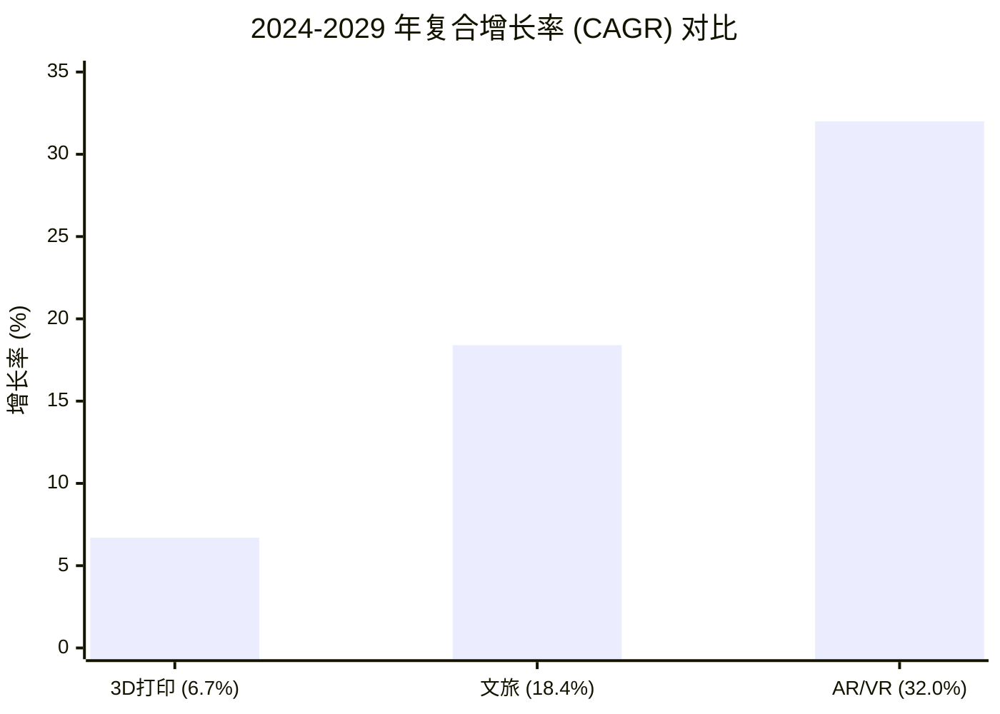
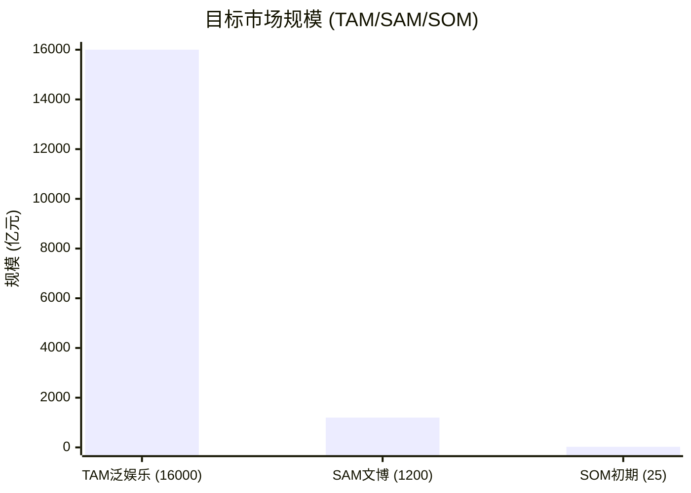
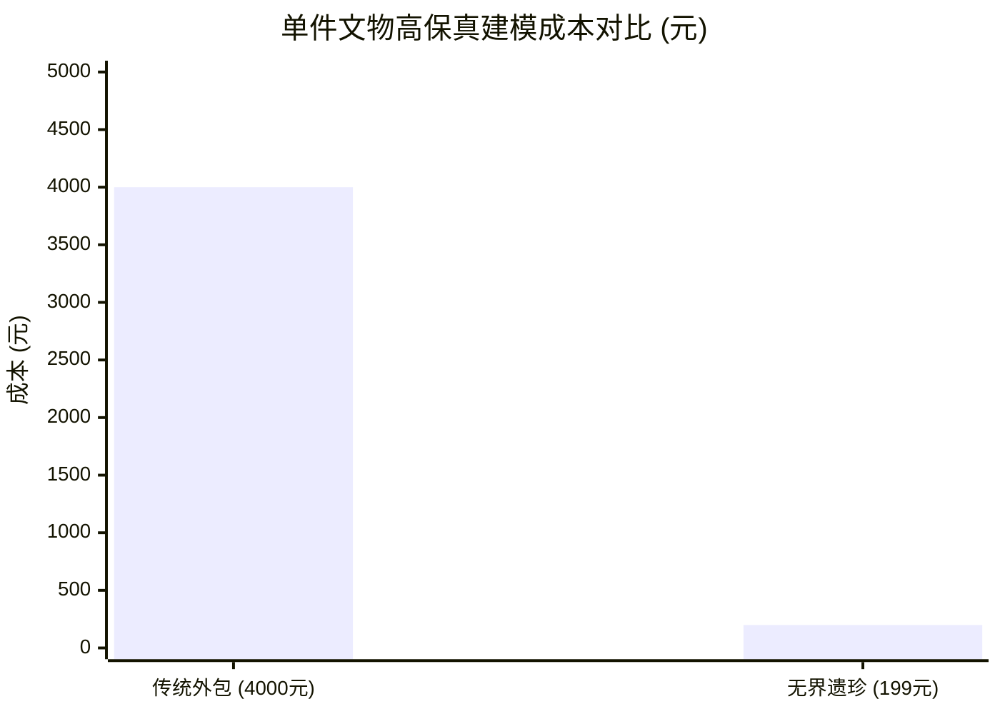
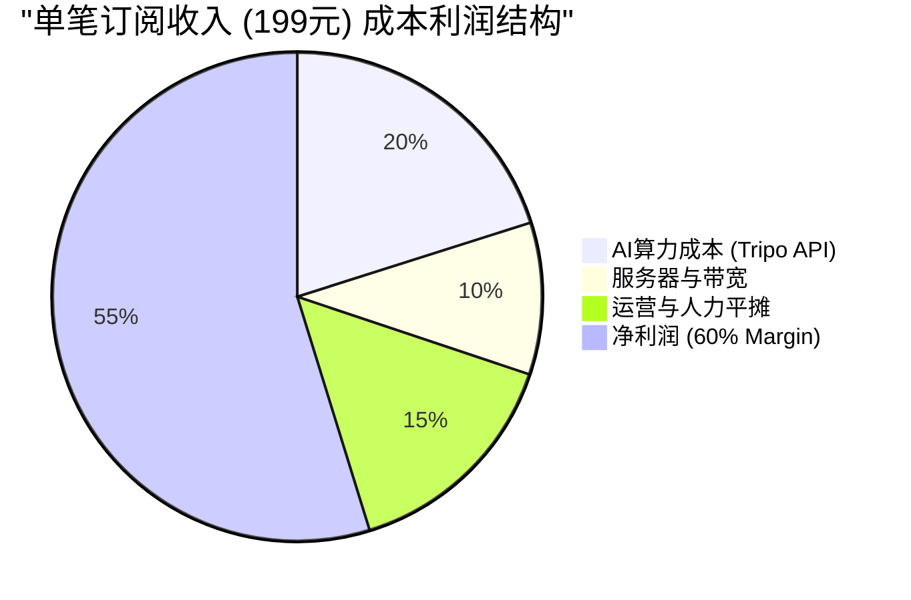
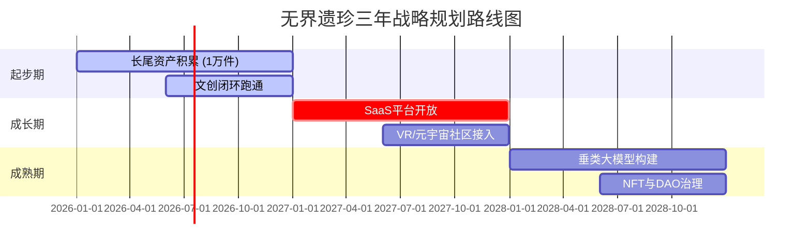
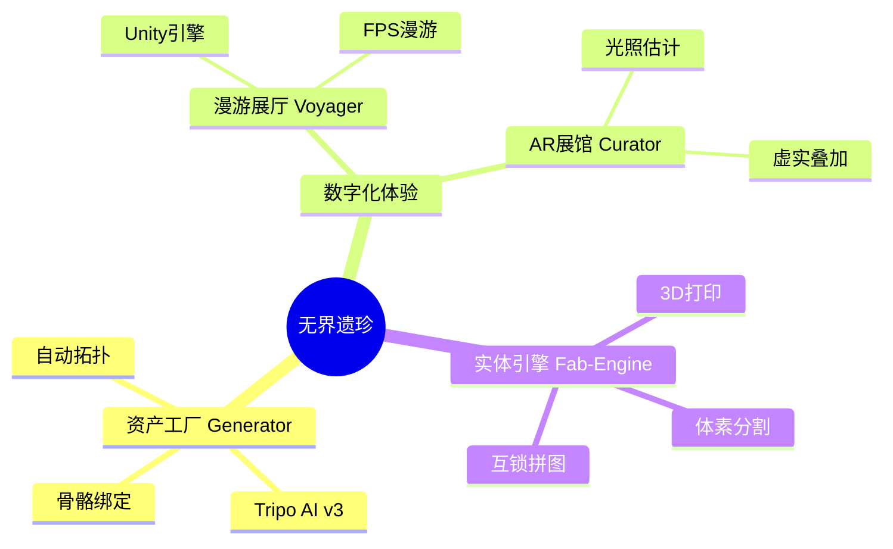
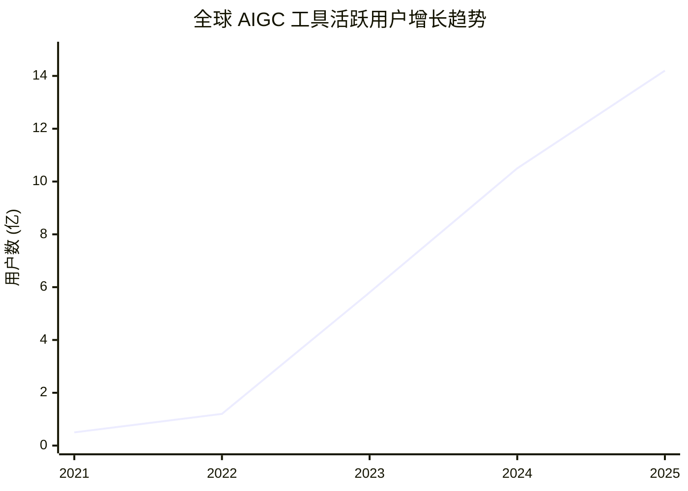
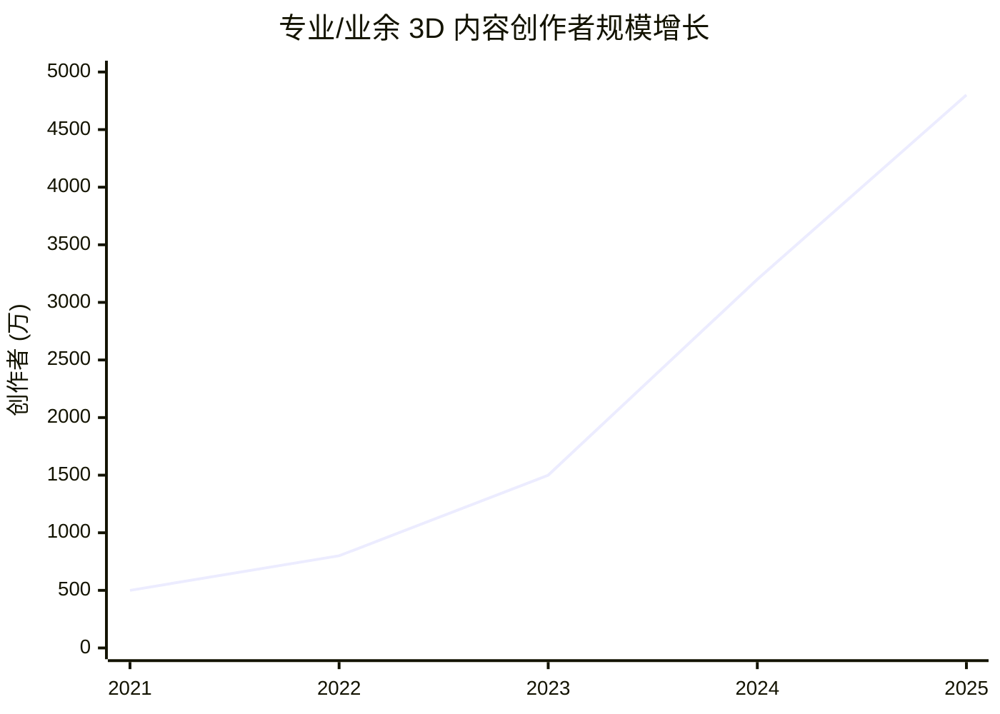

# 无界遗珍 (Boundless Treasures) 数据可视化图表

基于商业计划书中的核心数据生成。您只需提供数据，我即可为您生成如下各类图表。

## 1. 市场增长率对比 (柱状图)
展示不同赛道的年复合增长率 (CAGR)，凸显 AR/VR 与文旅赛道的高潜力。

## 2. 目标市场规模 TAM/SAM/SOM (漏斗/柱状对比)
展示从万亿级泛娱乐市场到专注于文博数字化细分市场的规模。
*(单位：亿元人民币)*

## 3. 成本效益分析 (折线图/对比图)
对比传统摄影测量建模与 Tripo AI 建模的成本差异。

## 4. 利润结构分布 (扇形图)
基于 199元 订阅费用的预估利润分配 (假设)。

## 5. 项目战略实施路线图 (甘特图)
对应商业计划书 2.5 节的三年规划。

## 6. 产品功能架构 (思维导图)
无界遗珍生态系统的层级结构。

## 7. 行业趋势洞察 (折线图)
展示 AIGC 爆发带来的指数级增长趋势与 3D 创作需求。

### 7.1 全球 AIGC 工具活跃用户增长趋势 (2021-2025)
*(单位：亿人，基于行业爆发趋势估算)*

| 年份 | 2021 | 2022 | 2023 | 2024 | 2025 |
| :--- | :--- | :--- | :--- | :--- | :--- |
| **活跃用户 (亿)** | 0.5 | 1.2 | 5.8 | 10.5 | 14.2 |

### 7.2 3D 内容创作需求与创作者增长 (2021-2025)
*(单位：万人，显示工具门槛降低带来的创作者爆发)*

| 年份 | 2021 | 2022 | 2023 | 2024 | 2025 |
| :--- | :--- | :--- | :--- | :--- | :--- |
| **创作者 (万人)** | 500 | 800 | 1500 | 3200 | 4800 |
